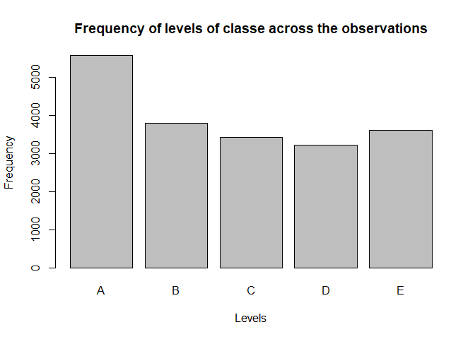
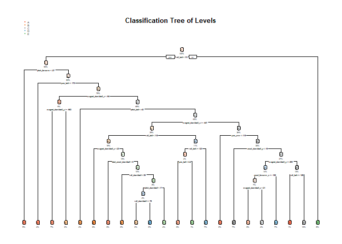

Background
----------

Using devices such as Jawbone Up, Nike FuelBand, and Fitbit it is now possible to collect a large amount of data about personal activity relatively inexpensively. These type of devices are part of the quantified self movement – a group of enthusiasts who take measurements about themselves regularly to improve their health, to find patterns in their behavior, or because they are tech geeks. One thing that people regularly do is quantify how much of a particular activity they do, but they rarely quantify how well they do it. In this project, your goal will be to use data from accelerometers on the belt, forearm, arm, and dumbell of 6 participants. They were asked to perform barbell lifts correctly and incorrectly in 5 different ways. More information is available from the website here: <http://web.archive.org/web/20161224072740/http:/groupware.les.inf.puc-rio.br/har> (see the section on the Weight Lifting Exercise Dataset).

The goal of your project is to predict the manner in which they did the exercise. This is the "classe" variable in the training set. You may use any of the other variables to predict with. You should create a report describing how you built your model, how you used cross validation, what you think the expected out of sample error is, and why you made the choices you did. You will also use your prediction model to predict 20 different test cases.

Data
----

The training data for this project are available here:

<https://d396qusza40orc.cloudfront.net/predmachlearn/pml-training.csv>

The test data are available here:

<https://d396qusza40orc.cloudfront.net/predmachlearn/pml-testing.csv>

The data for this project come from this source: <http://web.archive.org/web/20161224072740/http:/groupware.les.inf.puc-rio.br/har>.

Six young health participants were asked to perform one set of 10 repetitions of the Unilateral Dumbbell Biceps Curl in five different fashions: exactly according to the specification (Class A), throwing the elbows to the front (Class B), lifting the dumbbell only halfway (Class C), lowering the dumbbell only halfway (Class D) and throwing the hips to the front (Class E).

Environment setup
-----------------

We load the required libraries are loaded and set a constant seed value for reproducibility.

``` r
library(lattice)
library(ggplot2)
library(caret)
library(rpart)
library(rpart.plot)
library(randomForest)
```

``` r
set.seed(1456)
```

Getting and cleaning the data
-----------------------------

The test and train data is downloaded into the rawData folder.

``` r
# Download the data
trainUrl <-"https://d396qusza40orc.cloudfront.net/predmachlearn/pml-training.csv"
testUrl <- "https://d396qusza40orc.cloudfront.net/predmachlearn/pml-testing.csv"
trainFile <- "./rawData/pml-training.csv"
testFile  <- "./rawData/pml-testing.csv"
if (!file.exists("./rawData")) {
  dir.create("./rawData")
}
if (!file.exists(trainFile)) {
  download.file(trainUrl, destfile = trainFile)
}
if (!file.exists(testFile)) {
  download.file(testUrl, destfile = testFile)
}

# Load the data
trainingData <- read.csv(trainFile, header=TRUE, na.strings=c("NA", "", "#DIV/0!"))
testingData <- read.csv(testFile, header=TRUE, na.strings=c("NA", "", "#DIV/0!"))

dim(trainingData)
```

    ## [1] 19622   160

``` r
dim(testingData)
```

    ## [1]  20 160

Some of the variables are not relevant for predicting the activity class, which are the following: X, user\_name, raw\_timestamp\_part\_1, raw\_timestamp\_part\_2, cvtd\_timestamp, new\_window and num\_window. These variables get removed from the data set.

``` r
trainingData <- trainingData[, -c(1:7)]
```

Furthermore, by exploring the data we can see that a lot of NA values are present. Columns which have 90% of their values as NAs, are removed.

``` r
trainingData <- trainingData[,!(colSums(is.na(trainingData)) >= 0.9 * nrow(trainingData))]
```

Finally, the frequency of the different activitives (classes variable) is visualized on a histogram.

``` r
plot(trainingData$classe, main="Frequency of levels of classe across the observations", xlab="Levels", ylab="Frequency")
```



Partitioning the training data set for cross-validation
-------------------------------------------------------

The training data set is split into 70% training and 30% testing data. The models will be tested on the 30% testing data and the best one will be selected. The selection criteria will be better accuracy and lower expected out-of-sample error.

``` r
inTrain <- createDataPartition(y = trainingData$classe, p = 0.7, list=FALSE)
sTrainingData <- trainingData[inTrain,]
sTestingData <- trainingData[-inTrain,]
dim(sTrainingData); 
```

    ## [1] 13737    53

``` r
dim(sTestingData)
```

    ## [1] 5885   53

Decision Tree Model
-------------------

First a decision tree model is built with rpart function.

``` r
modFit1 <- rpart( classe ~ ., data = sTrainingData, method = "class")
```

The model's decision tree is the following.

``` r
rpart.plot(modFit1, main="Classification Tree of Levels", extra=100, under=TRUE, faclen=0)
```



We will know test how well the decision tree predicts the data on the created testing data.

``` r
predict1 <- predict(modFit1, sTestingData, type="class")
confusionMatrix(predict1, sTestingData$classe)
```

    ## Confusion Matrix and Statistics
    ## 
    ##           Reference
    ## Prediction    A    B    C    D    E
    ##          A 1513  190   37   80   42
    ##          B   32  679   57   39   71
    ##          C   35  176  808  222  201
    ##          D   78   60  113  596   40
    ##          E   16   34   11   27  728
    ## 
    ## Overall Statistics
    ##                                          
    ##                Accuracy : 0.7347         
    ##                  95% CI : (0.7233, 0.746)
    ##     No Information Rate : 0.2845         
    ##     P-Value [Acc > NIR] : < 2.2e-16      
    ##                                          
    ##                   Kappa : 0.6635         
    ##  Mcnemar's Test P-Value : < 2.2e-16      
    ## 
    ## Statistics by Class:
    ## 
    ##                      Class: A Class: B Class: C Class: D Class: E
    ## Sensitivity            0.9038   0.5961   0.7875   0.6183   0.6728
    ## Specificity            0.9171   0.9581   0.8695   0.9409   0.9817
    ## Pos Pred Value         0.8126   0.7733   0.5603   0.6719   0.8922
    ## Neg Pred Value         0.9600   0.9081   0.9509   0.9264   0.9302
    ## Prevalence             0.2845   0.1935   0.1743   0.1638   0.1839
    ## Detection Rate         0.2571   0.1154   0.1373   0.1013   0.1237
    ## Detection Prevalence   0.3164   0.1492   0.2450   0.1507   0.1387
    ## Balanced Accuracy      0.9105   0.7771   0.8285   0.7796   0.8273

The accuracy of this model is 0.7579.

Random Forest Model
-------------------

After the decision tree model a random tree forest model is applied on the training data set.

``` r
modFit2 <- randomForest(classe ~ ., sTrainingData, method="class")
```

The model is applied on the data set for testing.

``` r
predict2 <- predict(modFit2, sTestingData, type="class")
```

And then the confusion matrix of the classification is shown.

``` r
confusionMatrix(predict2, sTestingData$classe)
```

    ## Confusion Matrix and Statistics
    ## 
    ##           Reference
    ## Prediction    A    B    C    D    E
    ##          A 1671    4    0    0    0
    ##          B    3 1135    5    0    0
    ##          C    0    0 1021   18    0
    ##          D    0    0    0  946    1
    ##          E    0    0    0    0 1081
    ## 
    ## Overall Statistics
    ##                                           
    ##                Accuracy : 0.9947          
    ##                  95% CI : (0.9925, 0.9964)
    ##     No Information Rate : 0.2845          
    ##     P-Value [Acc > NIR] : < 2.2e-16       
    ##                                           
    ##                   Kappa : 0.9933          
    ##  Mcnemar's Test P-Value : NA              
    ## 
    ## Statistics by Class:
    ## 
    ##                      Class: A Class: B Class: C Class: D Class: E
    ## Sensitivity            0.9982   0.9965   0.9951   0.9813   0.9991
    ## Specificity            0.9991   0.9983   0.9963   0.9998   1.0000
    ## Pos Pred Value         0.9976   0.9930   0.9827   0.9989   1.0000
    ## Neg Pred Value         0.9993   0.9992   0.9990   0.9964   0.9998
    ## Prevalence             0.2845   0.1935   0.1743   0.1638   0.1839
    ## Detection Rate         0.2839   0.1929   0.1735   0.1607   0.1837
    ## Detection Prevalence   0.2846   0.1942   0.1766   0.1609   0.1837
    ## Balanced Accuracy      0.9986   0.9974   0.9957   0.9906   0.9995

The random tree forest model has a much better accuracy with 0.9947, with little misclassification as it can be seen in the confusion matrix.

Conclusions
-----------

We are going to select Random Forest model due to better accuracy results (0.9947) compared to Decision Tree method (0.7579).

Submission
----------

Now the model will be used to generate predictions on the original testing data set, which contains 20 observations. With above accuracy the results are expected to be accurate.

``` r
predict <- predict(modFit2, testingData, type="class")
predict
```

    ##  1  2  3  4  5  6  7  8  9 10 11 12 13 14 15 16 17 18 19 20 
    ##  B  A  B  A  A  E  D  B  A  A  B  C  B  A  E  E  A  B  B  B 
    ## Levels: A B C D E

And then finally, the files for submission are prepared.

``` r
# let's prepare files for submission
pml_write_files = function(x){
  n = length(x)
  for(i in 1:n){
    filename = paste0("problem_id_",i,".txt")
    write.table(x[i],file=filename,quote=FALSE,row.names=FALSE,col.names=FALSE)
  }
}
predict<-as.character(predict)
pml_write_files(predict)
```
